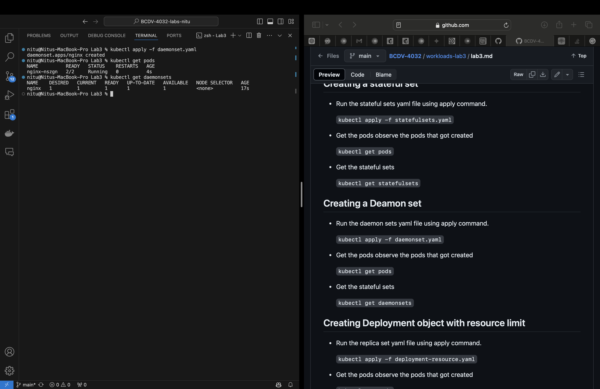

# Lab 3 
Nitu K Choudhary, 101529339

## Run a multi-node cluster

## Run all types of deployment yaml commands

## full stack application deployment

### DB

### Frontend

### Backend

Screenshot of checking db connections from one of the server deployemnts.

### Task: Bring down note-depp pod. Demonstrate using screenshot if a new pod has started.

